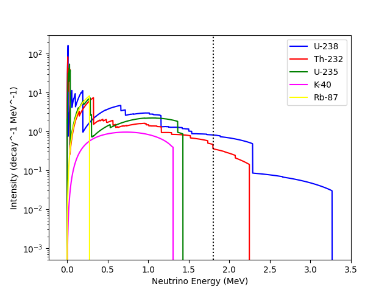

# Neutrino Spectrum Generation for Progenitor Nuclides

This project generates neutrino spectra for progenitor nuclides, taking into account the forbidden effects of non-unique forbidden decays through Overlap-Barrier Transition Densities (OBTDs). The formalism used in the calculations is based on the work of Behren's Buhring (1973).

## Overview

The code performs the following tasks:
- **Neutrino Spectrum Generation**: It calculates the neutrino spectra from beta decays of progenitor nuclides.
- **Non-unique Forbidden Decays**: The code accounts for the forbidden effects of non-unique forbidden decays using One-Body Transition Densities (OBTDs), which are crucial for accurate modeling of the spectra.
- **Formalism**: The theoretical framework and equations used for the calculations are derived from Behren's Buhring (1973), which is widely used in nuclear physics for such calculations.

## How It Works

To generate the neutrino spectrum, simply run the `main.py` script. This script will:
- Read input data for progenitor nuclides.
- Apply the necessary formalism for non-unique forbidden decays.
- Calculate the neutrino spectrum.
- Plots the result to a matplot figure.

## Figure 1

**Figure 1**: Illustration of the neutrino spectrum generated for the progenitor nuclides, including the effects of non-unique forbidden decays.

## Technical Details

The code implements the formalism from **Behren's Buhring (1973)**, specifically considering the forbidden effects of non-unique forbidden decays. This effect is modeled using Overlap-Barrier Transition Densities (OBTDs), which are incorporated into the decay rate calculations.

The neutrino spectrum generation relies on careful modeling of these decays, and the code ensures that the contribution from each allowed and forbidden transition is accurately included.

## Requirements

- Python 3.x
- Required Python packages (listed in `requirements.txt`)

## Installation

1. Clone this repository.
2. Install the dependencies.
